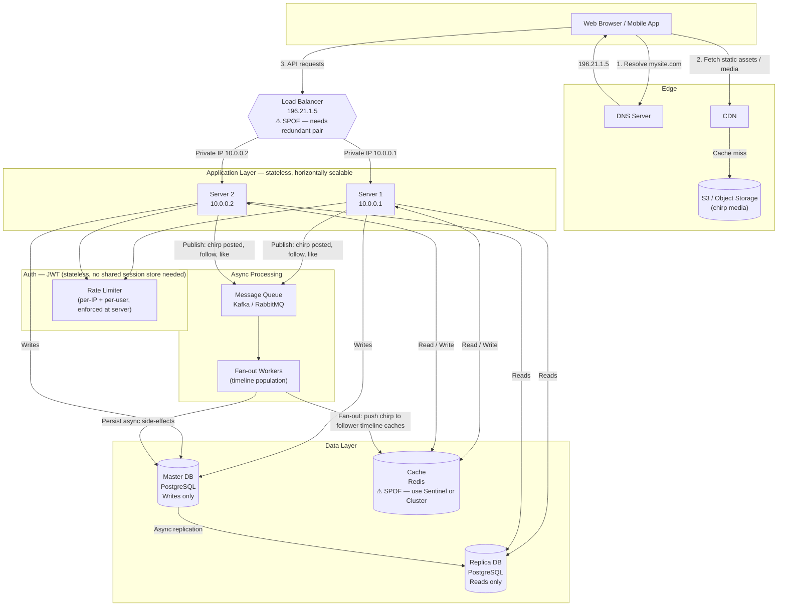

# Ciripitter — System Architecture

## Diagram

---

## Key Design Decisions

### Read / Write Split
All writes go to the Master DB. All reads go to the Replica. This is the primary
horizontal scaling lever for a read-heavy workload like a social feed.

**Replication lag caveat:** the replica is not instant. A user who just posted a
chirp and immediately refreshes their own profile may not see it (their read hits
the replica, which hasn't caught up). Mitigation: *read-your-writes consistency* —
for a short TTL after a write, route that specific user's reads to master (tracked
via a flag in Cache or a sticky cookie).

### Cache Strategy
Redis holds:
- Precomputed timelines (list of chirp IDs per user)
- Hot chirps and user profiles
- Rate-limit counters
- Read-your-writes flags (short TTL)

Cache invalidation triggers: chirp deleted, user profile updated, follow/unfollow.

### Fan-out Strategy
When a chirp is posted it must appear in every follower's timeline.

| Strategy | Writes | Reads | Problem |
|---|---|---|---|
| Fan-out on write | expensive | O(1) | Breaks for celebrity accounts (10M+ followers) |
| Fan-out on read  | cheap | expensive | Slow timelines at scale |
| **Hybrid** (target) | moderate | fast | Default: fan-out on write. For accounts above a follower threshold → fan-out on read, merged at query time |

Start with fan-out on write (simpler). Introduce the hybrid when follower counts
make it necessary.

### Auth
JWT (stateless). Tokens are verified at the server layer without a DB or cache
round-trip, which is essential for horizontal scaling. Refresh tokens stored in
Cache (Redis) so they can be revoked.

### Rate Limiting
Enforced at the application server before any DB or cache access. Two dimensions:
- Per IP (unauthenticated requests)
- Per user ID (authenticated requests)

Counters live in Redis with a sliding window or token bucket algorithm.

### SPOFs to Address Before Production
1. **Load Balancer** — deploy a redundant pair with keepalived/VRRP, or use a
   managed LB (AWS ALB, GCP LB) which handles this internally.
2. **Master DB** — configure automatic failover (Patroni + etcd for PostgreSQL)
   so a replica is promoted if master dies.
3. **Redis** — use Redis Sentinel (auto-failover) or Redis Cluster (sharding +
   failover).

---

## Build Order
1. Core schema: users, chirps, follows, likes
2. JWT auth (register, login, refresh, revoke)
3. Chirp CRUD + basic timeline (fan-out on read to start)
4. Cache layer: timeline caching, profile caching
5. Rate limiting
6. Message queue + fan-out workers
7. Read replica routing + read-your-writes consistency
8. Media uploads → S3
